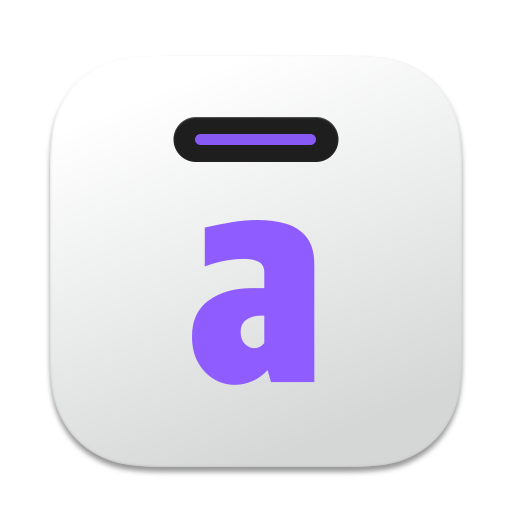

# ActionClip Actions

<p align="center">
  
</p>

<p align="center">
  <strong>The official action library for ActionClip.</strong><br>
  Small, focused tools for selected text on macOS.
</p>

<p align="center">
  
  
  
</p>

> [!IMPORTANT]
> This repository is private while the Action Marketplace version of ActionClip is being prepared. It is intended to become public after that app release. Do not change the repository visibility before the release checklist is complete.

## What is here?

This repository is the reviewable source for actions distributed through the ActionClip marketplace. Each action has its own portable `.actionclip.json` definition, while `catalog/catalog-v1.json` is the canonical catalog consumed by the app and publishing pipeline.

| Library | Count | Examples |
| --- | ---: | --- |
| Text tools | 17 | Clean lines, Slugify, Markdown formatting |
| Clipboard tools | 2 | Append to Clipboard, Swap with Clipboard |
| Developer tools | 17 | JSON, URL, HTML, Base64, case conversion |
| Productivity | 19 | Search, writing helpers, Large Type |
| App integrations | 27 | Fluent, DEVONthink, Tot, Scrivener and more |
| **Total** | **82** | [Browse every action](ACTIONS.md) |

## Browse the library

- [Text tools](ACTIONS.md#text-tools)
- [Clipboard tools](ACTIONS.md#clipboard-tools)
- [Developer tools](ACTIONS.md#developer-tools)
- [Productivity](ACTIONS.md#productivity)
- [App integrations](ACTIONS.md#app-integrations)

## Repository layout

```text
actions/                         One installable definition per action
  text-tools/
  clipboard-tools/
  developer-tools/
  productivity/
  app-integrations/
assets/app-icons/                App artwork used by integration listings
catalog/catalog-v1.json          Canonical marketplace catalog
schema/action-definition.schema.json
scripts/sync-actions.mjs         Regenerate split actions and ACTIONS.md
scripts/validate.mjs             Validate catalog and generated definitions
```

## Action definition

Every file under `actions/` is self-contained and includes catalog provenance:

```json
{
  "schemaVersion": 1,
  "documentType": "actionclip.marketplace.action-definition",
  "catalogRevision": "2026-08-21.1",
  "publishedAt": "2026-08-20T18:50:00Z",
  "action": {
    "id": "510A0C00-0002-4D9A-A001-000000000002",
    "name": "Clean Lines",
    "type": "javascript",
    "privacyKind": "onDevice"
  }
}
```

The full contract is in [`schema/action-definition.schema.json`](schema/action-definition.schema.json). Important fields are:

| Field | Meaning |
| --- | --- |
| `id` | Stable identifier. Never reuse an existing ID for a different action. |
| `type` | Action runtime: built-in, JavaScript, AppleScript, URL, or AI prompt. |
| `template` | The executable template or internal action identifier. |
| `outputMode` | Whether the result replaces text, is copied, or opens externally. |
| `privacyKind` | On-device, online, or handed to an external Mac app. |
| `requirements` | Setup or app requirements shown before installation. |
| `integration` | Optional metadata that connects related actions to one app listing. |

## Privacy model

Action definitions must say where selected text goes. The marketplace uses three explicit privacy classes:

- `onDevice`: the action runs locally inside ActionClip.
- `online`: the action deliberately sends text to an online service.
- `externalApp`: ActionClip hands text to another app installed on the Mac.

An action may not hide network access, shell execution, clipboard mutation, or communication with another app. See [CONTRIBUTING.md](CONTRIBUTING.md) for the review requirements.

## Working on the catalog

Node.js 20 or later is recommended. The repository has no runtime package dependencies.

```bash
npm run sync
npm test
```

`npm run sync` regenerates every split definition and `ACTIONS.md` from the canonical catalog. `npm test` validates required fields, enum values, unique IDs and names, generated files, privacy metadata, and catalog consistency.

## Publishing flow

1. Edit and review `catalog/catalog-v1.json`.
2. Run `npm run sync`.
3. Run `npm test` and review the generated diff.
4. Test the affected actions in the current ActionClip marketplace build.
5. Publish the validated catalog through the ActionClip release pipeline.

The app should fetch signed or otherwise trusted marketplace data from the release backend. This repository is the human-readable source and review surface; making it public must not make an unreviewed pull request automatically available in the app.

## Public-release checklist

- [ ] Marketplace-capable ActionClip version is publicly available.
- [ ] Every action has passed functional and privacy review.
- [ ] Download/import behavior is tested with the released app.
- [ ] Public contribution and moderation workflow is ready.
- [ ] Final open-source or source-available license is chosen explicitly.
- [ ] Security contact and support links are confirmed.
- [ ] Repository visibility is changed only after the checks above.

## Trademarks and app icons

Third-party product names and app icons identify compatible integrations. They remain the property of their respective owners and do not imply sponsorship or endorsement. Fluent UI System Icon names are used under Microsoft's MIT-licensed icon system; see the ActionClip product distribution for its bundled attribution.

## License

Copyright © 2026 ActionClip. All rights reserved. See [LICENSE](LICENSE).

